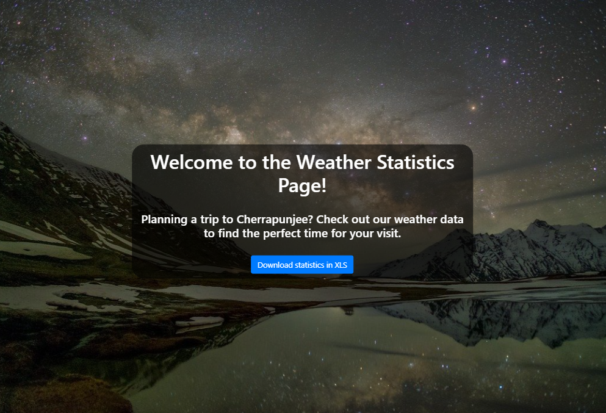

# Weather App

## Table of Contents

- [About The Project](#about-the-project)
- [Technologies](#technologies)
- [How To Start The Application](#how-to-start-the-application)


## About The Project
This is a Laravel project developed as part of a Codecool assignment to practise writing custom Artisan commands, generating Excel files using PHPSpreadsheet, and dockerizing a PHP application.
The original task description can be found in `weather-app/original-task.md`.

**`StoreWeatherData.php`**
- Based on the data created by the already existing `make:weather:data command`, this custom Artisan command retrieves weather data from a json file and stores it in the database (the database schema can be found in `database/schema/description.md`). When running the command `php artisan store:weather:data` in the console, the application searches for the JSON file, separates the data into different tables, checks weather the data already exists, and saves any changes to the database.

**`WeatherStatisticsController`**
- The controller reads data from the database and calculates, for each day of the week, the minimum temperature, average wind speed, maximum precipitation, and average grams of H2O per kg of air. When the `/stats/excel` endpoint is called, it saves the results to an Excel file.

**`welcome.blade.php`**
- The base view of the application allows users to directly save the statistical data to an Excel file.




## Technologies


## How To Start The Application
You can start the application with Docker Compose, by following these steps:

1. Ensure Docker and Docker Compose are installed on your system. You can check this by running `docker --version` and `docker-compose --version` in youre terminal.
2. Navigate to the root directory of your project where the `docker-compose.yml` is located.
    ```bash
   cd practise-laravel-project/weather-app
3. Start the application by running this command:
    ```bash
   docker-compose-up -d
4. Once the containers are up and running, you can access the application in your web browser at `http://localhost:YOUR_PORT` (replace `YOUR_PORT` with the port number specified in your `docker-compose.yml` file).
5. You can stop the application, by using the following command:
    ```bash
   docker-compose down